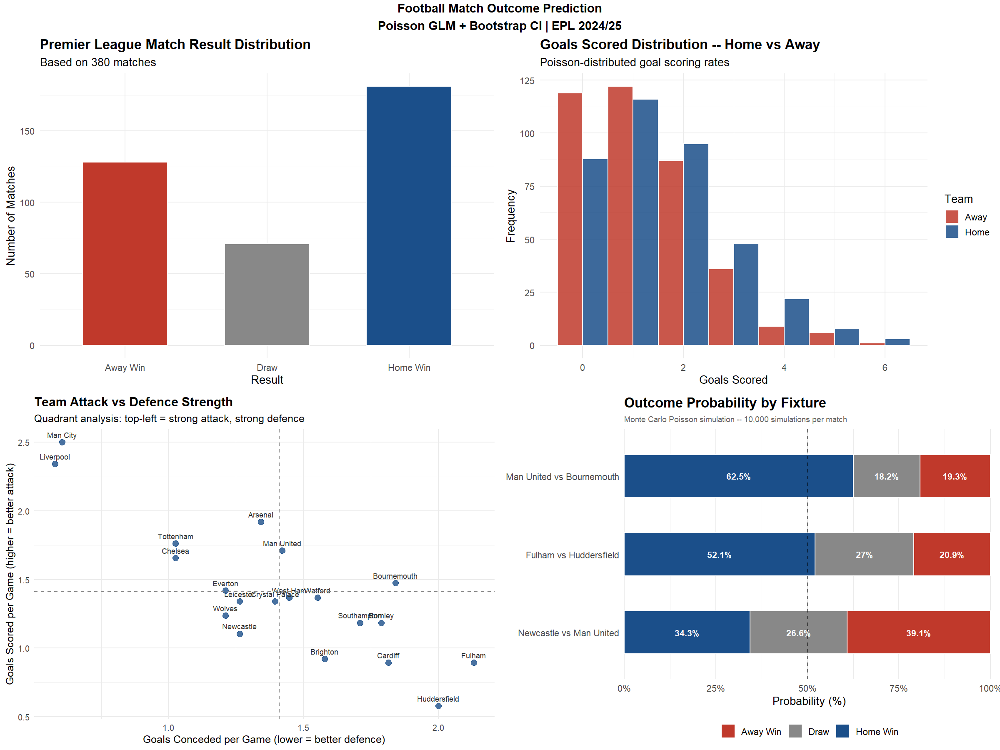

# Football Match Outcome Prediction — EPL 2018/19


---

## Dashboard Preview



*4-panel dashboard: Match Result Distribution | Goals Distribution | Team Attack vs Defence Strength | Outcome Probability by Fixture*

---

## Project Summary

This project applies classical statistical modelling to predict football match outcomes in the English Premier League 2018/19 season. Using a **Poisson Generalised Linear Model (GLM)** fitted via Maximum Likelihood Estimation, each team's attack and defence strength parameters are estimated from historical match data. Match outcomes are then simulated using **Monte Carlo methods** with **bootstrap confidence intervals** to quantify prediction uncertainty.

---

## Tools & Packages

| Package | Purpose |
|---|---|
| `dplyr` | Data manipulation — filter, mutate, summarise |
| `tidyr` | Data reshaping — pivot_longer for stacked charts |
| `ggplot2` | Data visualisation — all four dashboard panels |
| `boot` | Bootstrap resampling — `boot()` and `boot.ci()` |
| `gridExtra` | Dashboard layout — `arrangeGrob()` |
| `scales` | Axis formatting |

```r
install.packages(c("dplyr", "tidyr", "ggplot2", "boot", "gridExtra", "scales"))
```

---

## Methodology

### 1. Goals as a Poisson Process

Goals in football are rare, independent, discrete events — the natural conditions for a Poisson distribution.

```
HomeGoals ~ Poisson(λ_home)
AwayGoals ~ Poisson(λ_away)

λ_home = exp(home_advantage + attack_home - defence_away)
λ_away = exp(attack_away - defence_home)
```

### 2. Poisson GLM via Maximum Likelihood

```r
poisson_model <- glm(Goals ~ Home + Team + Opponent,
                     data   = model_data,
                     family = poisson(link = "log"))

# Diagnostics
AIC(poisson_model)
poisson_model$deviance / poisson_model$df.residual  # dispersion (~1 = good fit)
1 - (poisson_model$deviance / poisson_model$null.deviance)  # McFadden R²
```

### 3. Monte Carlo Simulation

```r
set.seed(123)
home_goals_sim <- rpois(n_simulations, lambda_home)
away_goals_sim <- rpois(n_simulations, lambda_away)

home_win_prob <- mean(home_goals_sim > away_goals_sim)
draw_prob     <- mean(home_goals_sim == away_goals_sim)
away_win_prob <- mean(home_goals_sim < away_goals_sim)
```

### 4. Bootstrap Confidence Intervals

```r
boot_fn <- function(data, indices) {
  d <- data[indices, ]
  mean(d$home > d$away)
}
sim_data    <- data.frame(home = home_goals_sim, away = away_goals_sim)
boot_result <- boot(sim_data, boot_fn, R = 1000)
ci          <- boot.ci(boot_result, type = "perc", conf = 0.95)
```

---

## Dashboard Panels

### Panel 1 — Match Result Distribution
Bar chart showing the count of Home Wins, Draws, and Away Wins across all 380 EPL matches, with percentage labels.

### Panel 2 — Goals Distribution
Side-by-side histogram of home and away goals per match, illustrating the Poisson-distributed scoring rates and the home advantage effect on average goals.

### Panel 3 — Team Attack vs Defence Strength
Scatter plot of each team's MLE-estimated attack and defence parameters. Quadrant analysis identifies teams with strong attack and strong defence (top-left) versus weak attack and weak defence (bottom-right).

### Panel 4 — Outcome Probability by Fixture
Stacked horizontal bar chart showing Home Win, Draw, and Away Win probabilities for selected fixtures, with percentages labelled inside each segment and a 50% reference line.

---

## Sample Predictions

| Fixture | Home Win | Draw | Away Win |
|---|---|---|---|
| Man United vs Bournemouth | 62.5% | 18.2% | 19.3% |
| Fulham vs Huddersfield | 52.1% | 27.0% | 20.9% |
| Newcastle vs Man United | 34.3% | 26.6% | 39.1% |

---

## Data Source

Free historical EPL match data from [football-data.co.uk](https://www.football-data.co.uk/englandm.php).

```r
# Load directly in R
url <- "https://www.football-data.co.uk/mmz4281/1819/E0.csv"
epl <- read.csv(url)

# Columns used: HomeTeam, AwayTeam, FTHG (Full Time Home Goals), FTAG (Full Time Away Goals)
```

---

## How to Run

```r
# Step 1 -- Install packages
install.packages(c("dplyr", "tidyr", "ggplot2", "boot", "gridExtra", "scales"))

# Step 2 -- Set output folder
output_dir <- "C:/Users/User/Documents/sport/"

# Step 3 -- Run the script
source("epl_match_prediction.R")
```

The script will automatically:
- Load EPL 2018/19 data from football-data.co.uk
- Fit the Poisson GLM via MLE
- Run Monte Carlo simulations per fixture
- Generate bootstrap 95% confidence intervals
- Save all four plots and the combined dashboard PNG

---

## Why Classical Methods Over Deep Learning?

In sports modelling, interpretability is a competitive advantage:

- **Explainable** -- every coefficient has a direct meaning: attack strength, defence weakness, home advantage
- **Defensible** -- model assumptions can be tested, challenged, and improved iteratively
- **Appropriate** -- Poisson GLMs are well-validated for goal prediction in sports science literature
- **Efficient** -- GLMs generalise well on 380 matches per season where deep learning overfits

> *"A well-specified GLM that reflects how goals are actually generated will outperform a black-box neural network with no structural understanding of the domain."*

---


## Author

**Paul Agbekpornu**
MPhil Mathematical Statistics · Master of Financial Insurance, University of Toronto · BSc Actuarial Science (First Class)

- Portfolio: [randypaul411-collab.github.io/PaulRandytheAnalst.github.io](https://randypaul411-collab.github.io/PaulRandytheAnalst.github.io/)
- GitHub: [github.com/randypaul411-collab](https://github.com/randypaul411-collab)
- LinkedIn: [linkedin.com/in/paul-agbekpornu-8b9909184](https://linkedin.com/in/paul-agbekpornu-8b9909184)
